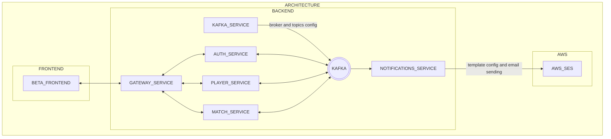

# Bird Sight Architecture

```mermaid

    flowchart LR

    subgraph ARCHITECTURE

        direction LR

        subgraph FRONTEND
            BETA_FRONTEND
        end
        
        subgraph BACKEND
            direction BT

            GATEWAY_SERVICE
            GATEWAY_SERVICE <--> AUTH_SERVICE
            GATEWAY_SERVICE <--> PLAYER_SERVICE
            GATEWAY_SERVICE <--> MATCH_SERVICE

            KAFKA(((KAFKA)))
            KAFKA_SERVICE --broker and topics config--> KAFKA
            AUTH_SERVICE <--> KAFKA
            PLAYER_SERVICE <--> KAFKA
            MATCH_SERVICE <--> KAFKA
            KAFKA --> NOTIFICATIONS_SERVICE
        end

        subgraph AWS
            direction BT
            
            NOTIFICATIONS_SERVICE --template config and email sending--> AWS_SES
        end
    end
    
    BETA_FRONTEND <--> GATEWAY_SERVICE

```