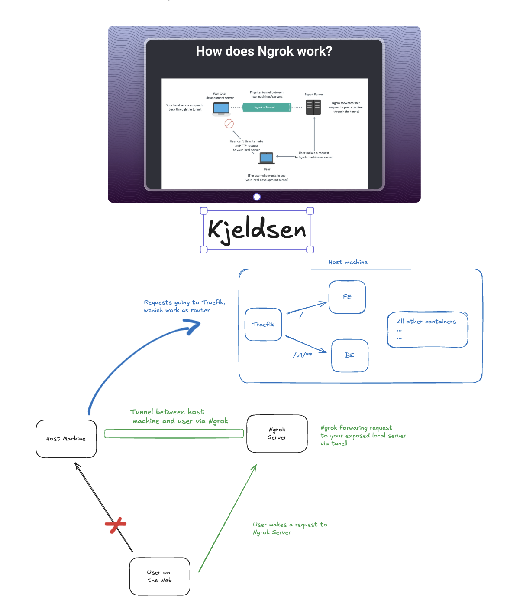
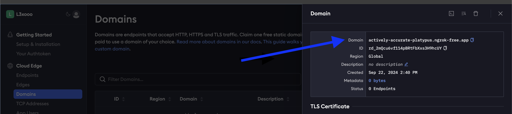
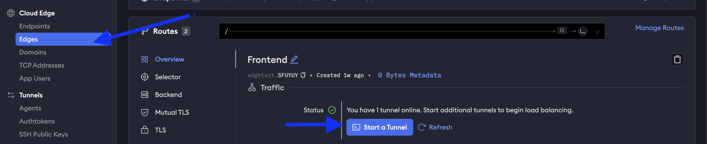
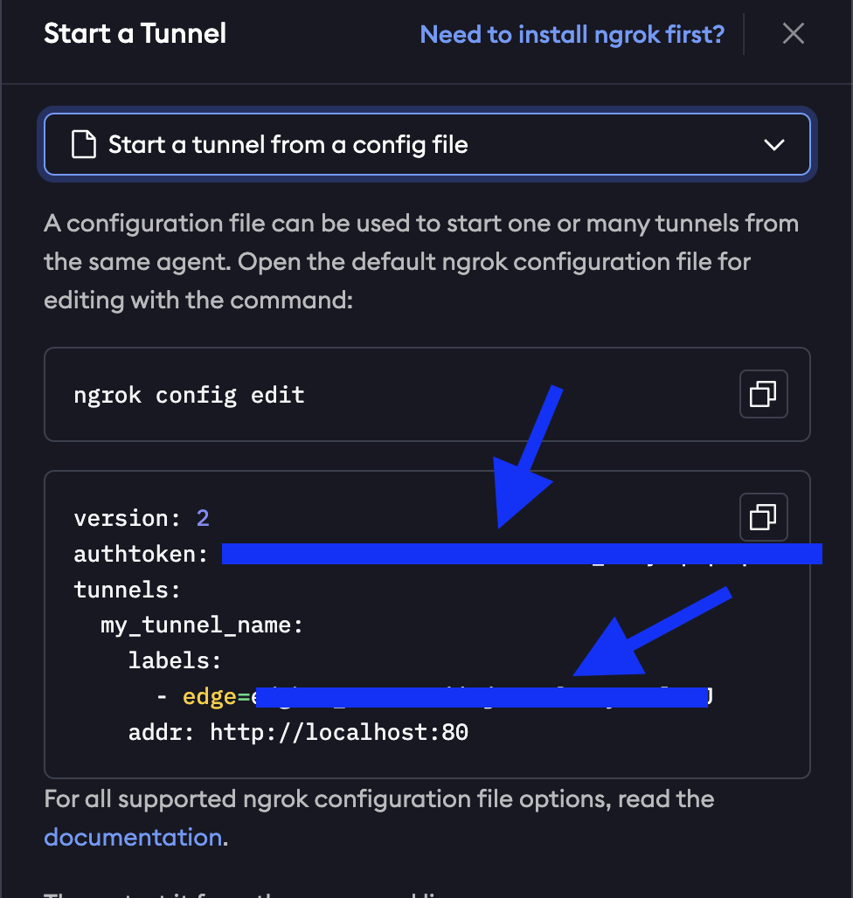

# Hosting From Machine

This documentation provides step-by-step instructions on setting up ngrok to expose your locally hosted 
application to the internet. By following these steps, you'll be able to share your application with others, 
allowing them to access it from anywhere.
Learn more about Ngrok [here](https://ngrok.com/) 

## Traefik

Traefik is an open-source reverse proxy and load balancer designed specifically 
for microservices architectures. It acts as a gateway, routing incoming traffic to various 
backend services based on defined rules. 

We use Traefik for routing the requests that are comming from Ngrok domain. With the endpoint specification
provided in the `local-env/docker-compose.yml` under **labels** of **main-service** and **beta-frontend** Traefik route
incoming requests to desired container. This was needed for us as we will provide only one domain because both
BE and FE are running on machine locally.

## Ngrok account

To start hosting your application, you need to create a ngrok account 
(the free tier is sufficient for testing purposes; if we reach a higher volume of requests, upgrading may be necessary).

## How it should work

Ngrok start on your local machine and specify the port of the machine/local server that you want to expose.
When you expose Ngrok create a secure tunnel to a public endpoint that is accessible over internet.
In Kjeldsen we expose the Traefik port which is used as router. Based on the endpoint that is incoming Traefik handle the
routing and point the request to the desired service.
 {width="700"}

## Setting up environment
1. Go to the Ngrok domains to get domain address
 {width="500"}
2. Go to the `local-env/config/beta-frontend` and paste your domain URL to variables under **Ngrok Hosting** 
3. Uncomment the section for **Ngrok Hosting** and comment section for **Docker Run**
4. In the Ngrok UI in the sidebar go to `Cloud Edge -> Edges` and click on Start Tunnel
 {width="500"}
5. In the pop-up window switch to `Start a tunnel from a config file` and copy the authtoken and edge and paste it in 
config file which is located `local/config/ngrok.yml`
 {width="500"}
6. Uncomment the Traefik service in `docker-compose.yml`

## Start hosting
 
To start hosting the app just run go to the `/local-env` and run 
`docker-compose up -d --build` which will start up containers. After that navigate to the 
url provided by Ngrok to access the UI
