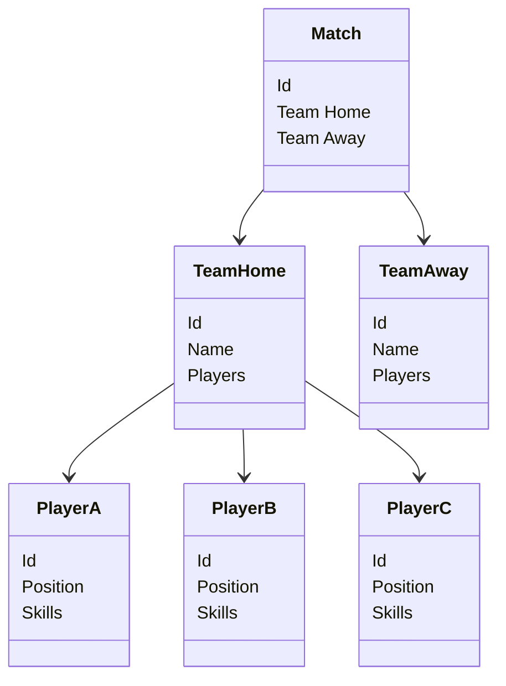
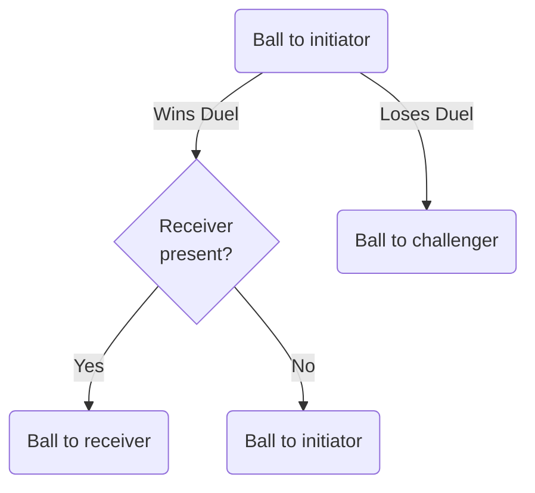
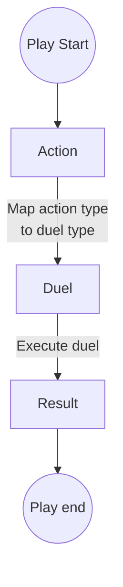
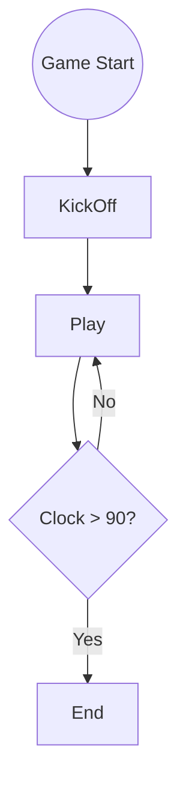
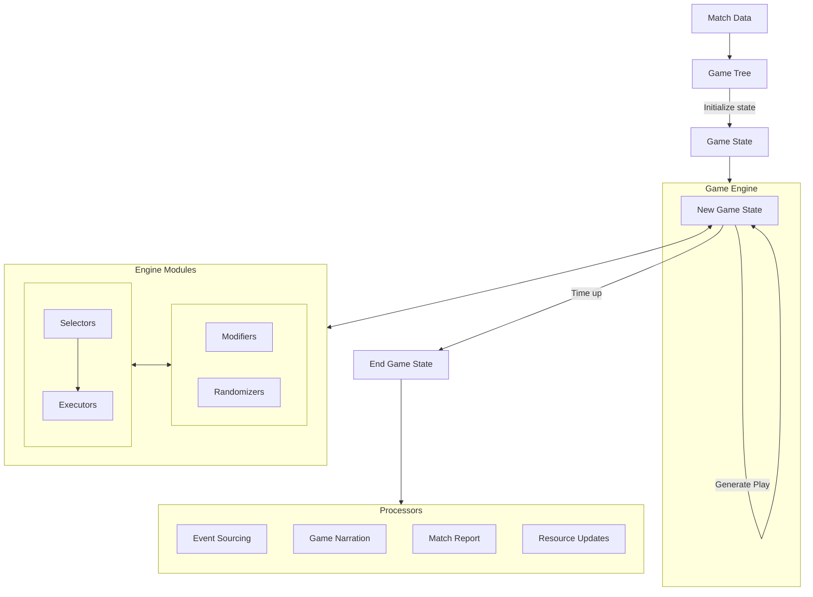

# Match Service

El servicio de partidos es responsable de simular juegos entre equipos.

## Preparación del juego

Antes de que se pueda jugar un partido, el motor del juego necesita una estructura de datos que
contenga toda la información requerida para ejecutar el juego: equipos, atributos, jugadores,
habilidades, etc.

Esta información se agrega desde la base de datos y se almacena en una estructura de árbol que luego
se pasa al motor del juego.



## Game state

A partir de los datos en el árbol, el motor construye un estado que representa, en cualquier momento
dado, una instantánea del juego. El tipo de información que podría representarse aquí incluye:

- Reloj: cuántos minutos han pasado desde el inicio del juego
- Tiempo añadido: cuántos minutos se han agregado al reloj debido a faltas y lesiones
- Posiciones de juego: dónde está cada jugador en el campo
- Posición del balón: en qué área del campo se encuentra el balón
- Poseedor del balón: qué jugador tiene el control del balón
- Marcador: cuántos goles ha marcado cada equipo
- Faltas: cuántas faltas ha cometido cada equipo
- Tarjetas: qué jugadores han sido amonestados
- Lesiones: qué jugadores han sido lesionados
- Sustituciones: qué jugadores han sido sustituidos

Cuando algo en el juego sucede, el estado del juego se actualiza para reflejar los cambios. Por
ejemplo, supongamos que un jugador pasa el balón a un compañero de equipo. En este caso, necesitamos
actualizar el reloj, basado en cuánto tiempo lleva completar un pase, y el estado del balón, basado
en el jugador receptor y su ubicación. Todo lo demás permanece igual en este escenario.

| **State attribute** | **Before**  | **After**   |
|---------------------|-------------|-------------|
| Clock               | 20          | 22          |
| Added time          | 1           | 1           |
| Player positions    | [positions] | [positions] |
| Ball position       | Left back   | Midfield    |
| Ball holder         | Player F    | Player G    |
| Score               | 2           | 2           |
| ...                 | ....        | ...         |

El estado del juego se representa mediante clases de estado: `BallState`, `TeamState`, etc. Estos no
se guardan en la base de datos. Cuando el juego termina, el estado final se usa para activar eventos
y generar cualquier dato que se deba guardar.

## Game play

### Plays, Actions, Duels, and Opportunities

Los términos utilizados aquí corresponden a las clases en el motor del juego.

La unidad básica del juego es un `Play`. Una jugada es una acción individual que transiciona el
juego de un estado a otro. Cada jugada tiene un tipo de `Action`: un pase, un regate, un tiro, etc.

Cada jugada también involucra un `Duel`, que es una interacción entre dos jugadores. Por ejemplo, un
tiro es un duelo entre el jugador atacante y el portero. El jugador que inicia el duelo puede ganar
o perder el duelo - esto es el `DuelResult`.

Hay algunas instancias en las que las jugadas requieren una configuración de duelo no estándar. Por
ejemplo, jugadas que involucran un duelo que siempre debe resultar en una victoria (en esta versión,
los pases siempre ganan). Aquí podemos crear un duelo ficticio que nunca se puede perder: un jugador
intenta interceptar el pase pero siempre falla.

Otro caso especial es el juego que involucra múltiples duelos. En el fondo, cada acción debe llevar
a un solo duelo, por lo que aquí simplemente dividimos el juego en dos partes, cada una con su propia
acción. Esto asegura una relación uno a uno entre acciones y duelos.

Hay algunas instancias en las que las jugadas requieren una configuración de duelo no estándar. Por
ejemplo, jugadas que involucran un duelo que siempre debería resultar en una victoria (en esta
versión, los pases siempre ganan). Aquí podemos crear un duelo ficticio que nunca se puede perder.
Otro caso especial es la jugada que involucra múltiples duelos. Bajo el capó, cada acción debe
conducir a un único duelo, así que aquí simplemente dividimos la jugada en dos partes, cada una con
su propia acción. Esto asegura una correspondencia uno a uno entre acciones y duelos.

La información requerida para crear un duelo depende de la acción. A veces es necesario un compañero
de equipo además del jugador del equipo contrario.

- El jugador que inició el duelo (el jugador atacante) se llama `initiator` (iniciador) para evitar
  la confusión con la posición de jugador 'atacante'.
- El jugador que defiende el duelo se llama de manera similar `challenger` (retador) para evitar
  confusión con la posición de 'defensor'.
- El jugador que recibe el balón (en caso de un duelo exitoso) es el `receiver` (receptor). Esto
  aplica solo a acciones como pases, no tiros.

Donde termina la pelota es determinado por quien gana el duelo y si hay un receptor presente. Si el
iniciador gana el duelo, entonces la pelota va al receptor si hay uno presente (por ejemplo, en un
pase) pero si no hay un receptor entonces el iniciador retiene la pelota (por ejemplo, en un
drible). Si el duelo se pierde, entonces la pelota va al retador (por ejemplo, en un tackle). Un
jugador siempre debe estar en posesión de la pelota, incluso si no la controla físicamente, o si
está fuera de juego, por lo que "posesión" aquí es un marcador para determinar el jugador activo
(más sobre esto más adelante).



El estado del juego realiza un seguimiento de cada jugada y la almacena en una lista. Al final de un
juego, esta lista contendrá todas las jugadas que ocurrieron en el juego, su tipo de acción, los
duelos involucrados y el resultado de cada duelo. Cualquier otro metadato podría almacenarse aquí
ya que esta lista de jugadas es efectivamente toda la historia del juego. Un fragmento de muestra de
las jugadas podría verse así:

```json
{
  "plays": [
    {
      "action": "PASS",
      "duel": {
        "duelType": "PASSING",
        "initiator": "<player A>",
        "challenger": "<player B>",
        "receiver": "<player C>",
        "statistics": "<details about duel>",
        "result": "WIN"
      },
      "minute": 2,
      "pitchArea": "MIDFIELD"
    },
    {
      "action": "DRIBBLE",
      "duel": {
        "duelType": "BALL_CONTROL",
        "initiator": "<player C>",
        "challenger": "<player D>",
        "statistics": "<details about duel>",
        "result": "WIN"
      },
      "minute": 3,
      "pitchArea": "MIDFIELD"
    }
  ]
}
```

Las jugadas pueden ser agregadas y depuradas en una `Opportunity`, que es una secuencia de jugadas del
mismo equipo y termina ya sea con un gol o con el equipo atacante perdiendo el control del balón. (
Potencialmente, otras formas de "puntos destacados" podrían derivarse de las jugadas, con diversos
grados de especificidad). Algunas jugadas que no constituyen oportunidades podrían ser ignoradas al
agregarlas en oportunidades. Por ejemplo, un pase que es interceptado por el equipo contrario no se
considera una oportunidad.

(Tenga en cuenta que las oportunidades fueron una parte integral del diseño inicial del juego, pero
su implementación se ha pospuesto para considerar formas alternativas de destacados.)

Existe un mapeo entre acciones y tipos de duelo para determinar qué duelo ejecutar para cada jugada.
Cabe señalar que las acciones son verbos escritos en forma imperativa o infinitiva ("disparar" en
lugar de "disparando" o "disparado") para distinguirlos de los tipos de duelos, que se escriben ya
sea como sustantivos (duelo de "tiro") o adjetivos (duelo "posicional") o gerundio ("duelo de
pase"), o lo que sea necesario para evitar conflictos de nombres.

| **Action** | **Duel Type**     |
|------------|-------------------|
| Pass       | Passing duel      |
| Position   | Positional duel   |
| Tackle     | Ball control duel |
| Shoot      | Shot duel         |
| Foul       | Aggression duel   |

(La asignación uno a uno entre acciones y duelos es algo redundante ahora ya que el tipo de duelo
se puede inferir del tipo de acción. Sin embargo, esta separación es útil para generar una narración
del partido y mantener las cosas flexibles.)

### Play generation

Para generar una jugada, el motor selecciona una acción para el jugador en posesión del balón. A
partir de esto determina el tipo de duelo y los demás participantes (retador y/o receptor). Luego se
puede ejecutar el duelo, y se determina el resultado. La jugada ahora está completa y el estado del
juego puede ser transicionado dependiendo de los detalles del duelo.




El motor continúa generando jugadas hasta que termina el juego. Esto ocurre cuando el reloj pasa de
90 minutos (ignorando por ahora el tiempo añadido, tiempo extra, penaltis, etc.). La única excepción
a esto es la primera jugada, el saque inicial, que es un caso especial de jugada que ocurre al
inicio del juego. Un jugador tiene que ser seleccionado aquí ya que ningún jugador está en posesión
del balón al inicio del juego.



## Pitch areas

El campo se divide en una cuadrícula de 3x3. CENTER_FORWARD se asigna directamente a la caja de
penalti a pesar de que el área es más grande.

|----------------|------------------|-----------------|
|  LEFT_FORWARD  |  CENTRE_FORWARD  |  RIGHT_FORWARD  |
|----------------|------------------|-----------------|
|  LEFT_MIDFIELD |  CENTRE_MIDFIELD |  RIGHT_MIDFIELD |
|----------------|------------------|-----------------|
|  LEFT_BACK     |  CENTRE_BACK     |  RIGHT_BACK     |
|----------------|------------------|-----------------|

**Ranks**

El campo se divide en filas de adelante, medio y atrás:

|----------------|------------------|-----------------|
|  FORWARD       |  FORWARD         |  FORWARD        |
|----------------|------------------|-----------------|
|  MIDDLE        |  MIDDLE          |  MIDDLE         |
|----------------|------------------|-----------------|
|  BACK          |  BACK            |  BACK           |
|----------------|------------------|-----------------|

**Files**

Y archivos izquierdo, central y derecho:

|----------------|------------------|-----------------|
|  LEFT          |  CENTRE          |  RIGHT          |
|----------------|------------------|-----------------|
|  LEFT          |  CENTRE          |  RIGHT          |
|----------------|------------------|-----------------|
|  LEFT          |  CENTRE          |  RIGHT          |
|----------------|------------------|-----------------|

El área del campo del balón es desde la perspectiva del equipo atacante. Si un atacante está en el
área de RIGHT_FORWARD, entonces cuando el motor selecciona un defensor para desafiar el balón,
necesitará convertir el área a LEFT_BACK cuando se aplique al equipo defensor (hay una función
disponible para cambiar la perspectiva del área del campo). Este método requiere algo de tiempo
para acostumbrarse, pero es más natural que usar números (1-9) para etiquetar las áreas. Lo único
que hay que recordar es que cuando operamos en el equipo defensor, el área del campo (o rango o
archivo) debe ser volteada.

Tenga en cuenta que cuando buscamos un retador en el lado opuesto del campo como el iniciador, no
necesitamos voltear el archivo, porque el izquierdo del iniciador es el derecho del retador, por lo
que si el iniciador está en el archivo LEFT, entonces desde la perspectiva del retador están en el
archivo RIGHT. Esto puede ser confuso al principio, pero al usar las funciones proporcionadas para
orientar el área del campo, debería ser sencillo de implementar.

Cuando un jugador del equipo defensor toma el control del balón, el motor girará la orientación del
campo. Si un defensor de la espalda derecha gana un duelo en el área de LEFT_FORWARD, entonces el
nuevo área de balón será RIGHT_BACK.
  

## Engine components

Hay cuatro componentes que se utilizan para generar jugadas.

### Selectors

En la generación de jugadas descrita anteriormente, hay algunas decisiones que tomar: qué jugadores
seleccionar en el saque inicial, qué acciones tomar y en los duelos resultantes, qué participantes
seleccionar (los retadores y los receptores). Siempre que se necesita una decisión, esto se delega a
una de las clases de selección. Estas son sin estado y toman como entradas el estado del juego y
devuelven una selección para que la generación de jugadas continúe.

Seleccionar jugadores implica calcular probabilidades basadas en la información relevante, por
ejemplo, en qué área del campo está el balón, el tipo de acción que se está realizando y el equipo y
sus habilidades.

Seleccionar acciones implica dos pasos. Primero, se requiere la jugada anterior para saber qué
acciones son legales para la jugada actual. Por ejemplo, si un jugador dispara y falla, la siguiente
acción no puede ser un regate, ya que el único movimiento válido después de esto es un saque de
meta. Si un jugador saca el balón del juego, la siguiente acción debe ser un saque de esquina o un
saque de banda. Segundo, se selecciona una acción de las acciones legales basadas en las habilidades
del jugador en posesión del balón, la estrategia del equipo, etc.

Un punto importante es que las acciones son desde la perspectiva del jugador que tomó el control del
balón al final del último duelo. Si el duelo fue un pase y resultó en una victoria, entonces las
acciones se aplican al compañero de equipo que recibió el balón. Si el duelo fue un tiro y resultó
en una derrota, entonces la acción se aplica al portero que salvó el balón.

Para seleccionar una acción, necesitamos saber la acción anterior, el resultado del duelo y quién es
el jugador activo. La siguiente tabla muestra ejemplos de acciones válidas para cada combinación de
acción anterior y resultado del duelo. De la lista de acciones válidas, se selecciona una en función
del jugador activo (por ejemplo, un saque de meta solo es válido si el jugador activo es el
portero). El motor también intenta mantener las acciones sensatas, por lo que si el jugador activo
es un defensor, entonces un tiro es técnicamente una acción válida, pero es poco probable que se
seleccione.


| **Previous Action** | **Valid actions if duel won** | **Valid actions if duel lost** |
|---------------------|-------------------------------|--------------------------------|
| Pass                | Position                      | Pass, throw-in, goal-kick      |
| Position            | Pass, shoot                   | Tackle, foul                   |
| Tackle              | Pass, shoot                   | Pass, shoot                    |
| Shoot               | Goal                          | Corner-kick, goal-kick         |

Tenga en cuenta que a veces el motor debe considerar que un jugador está en "posesión" del balón
incluso si físicamente no controla el balón. Por ejemplo, si un defensor gana un duelo posicional
significa que está lo suficientemente cerca del atacante para intentar una entrada, pero aún no
tiene el balón. Sin embargo, en esta situación, el motor tomará a ese jugador como el que tiene el
control del balón. Este comportamiento es solo interno y no afecta al realismo del juego ya que la
posesión es simplemente un marcador para determinar al jugador activo. En la narración y el informe
del partido, las jugadas pueden describirse de manera que oculten este detalle de implementación.

### Executors

Una vez que las clases de selección han elegido jugadores y acciones, se ejecuta un duelo. Para
determinar el resultado de un duelo, se utilizan las clases ejecutoras. Al igual que los selectores,
estas también son sin estado y toman como entradas el estado del juego y los detalles del duelo, y
devuelven un resultado.

Un resultado simple del duelo podría calcularse a partir de los atributos del jugador. Por ejemplo,
si las habilidades de pase del iniciador son mejores que las habilidades de intercepción del
retador, entonces el iniciador gana. Los casos más complejos involucran "asistencia" (cuánto apoyo
recibe un jugador de sus compañeros de equipo) y "carryover" (puntos que se transfieren del duelo
anterior).

### Randomizers

Los randomizers añaden un elemento de imprevisibilidad a los procesos de selección y ejecución. En
los duelos, por ejemplo, el resultado se determina (además de la habilidad y la asistencia del
compañero de equipo) por el rendimiento de un jugador, que es un número semi-aleatorio añadido al
cálculo. Este número se genera para cada duelo y los números generados anteriormente se utilizan
para determinar el siguiente número. Esto es para asegurar un nivel aceptable de estabilidad y para
evitar demasiadas victorias o derrotas consecutivas que se deben simplemente a una serie
desafortunada de empates.

Hay otros factores que afectan la generación de números aleatorios, como la experiencia del jugador:
los jugadores más experimentados son más consistentes y, como tal, su rendimiento toma un rango más
pequeño de valores posibles.

### Modifiers

Para la selección de jugadores, acciones, duelos, participantes de duelos y resultados de duelos,
se agregan modificadores al proceso como una forma de estrategia. Los modificadores se utilizan en
varios lugares: para cambiar las probabilidades de seleccionar un jugador, las probabilidades de
ganar un duelo, los parámetros del duelo. Los dos tipos principales de modificadores son:

- Órdenes de jugadores - instrucciones dadas a los jugadores para cambiar su comportamiento. Por
  ejemplo, un jugador podría ser instruido para jugar más agresivamente, o para centrarse en la
  defensa.
- Estrategias de equipo - instrucciones dadas al equipo en su conjunto. Por ejemplo, un equipo
  podría ser instruido para jugar más centralmente, o para centrarse en los flancos.

## Implementation

Este servicio está construido en Java funcional. Ignorando algunas excepciones raras (y
aleatoriedad / registro), el motor utiliza y debe continuar utilizando funciones puras, la API de
transmisión para el procesamiento de listas y la API opcional para tratar con mapeos y
transformaciones. También hace uso de objetos inmutables siempre que sea posible, en particular para
el estado del juego (ver más abajo). Otras cosas a evitar son la herencia excesiva (el polimorfismo
debe lograrse a través de interfaces, pero la composición es preferible en general) y el uso
excesivo de nulos.

En la mayoría de los casos, al agregar una nueva característica que afecta el juego, el módulo debe
tomar todo el estado del juego como entrada y devolver un nuevo estado del juego como salida, sin
interactuar con ningún otro módulo. Si se necesita realizar un seguimiento de algún aspecto del
juego, debe agregarse al objeto de estado del juego. (La lista de jugadas también se puede utilizar
para realizar un seguimiento del historial del juego, aunque no siempre es eficiente recorrer todas
las jugadas para encontrar la información relevante.)


### The game state object

El objeto de estado del juego es inmutable, lo que significa que no se puede modificar una vez que
ha sido creado. En su lugar, el motor creará un nuevo estado cada vez que se ejecute una jugada (el
anterior se descarta),
sin  [efectos secundarios](https://en.wikipedia.org/wiki/Side_effect_(computer_science)). Este
patrón reduce errores, asegura que el estado del juego sea consistente y facilita el razonamiento
sobre las transiciones: una función toma el estado anterior como entrada y devuelve un nuevo estado
basado en la jugada, por lo que no hay necesidad de preocuparse por lo que otras funciones están
haciendo. También permite la prueba de funciones de forma aislada, ya que cada función es
responsable solo del código dentro de su ámbito.

### Post-game processing

Después de que el juego se completa, la lista de jugadas puede ser utilizada para generar un informe
del partido y para guardar oportunidades en la base de datos, y para cualquier otra cosa que pueda
ser necesaria. Por ejemplo:

- Event sourcing - para la integración con el modelo de event sourcing, la lista de jugadas se puede
  utilizar para crear casos de uso y eventos.
- Narración del juego - convirtiendo cada jugada en una oración legible, se puede crear un juego
  narrativo, aunque esto se hará parcialmente por el frontend.
- Actualizaciones de recursos - los jugadores y los equipos también se pueden actualizar en función
  de su rendimiento en el juego
- Informe del partido - un resumen del juego, incluyendo estadísticas (posesión, tiros a puerta,
  etc.)
- API web - proporcionar servicios para frontends

Todo esto se hace después de que el juego termine para verificar que cada jugada fue válida y
condujo a un estado final legal. Si la generación del juego falla, una lista parcial de jugadas
puede ser devuelta como parte del mensaje de error para permitir a los usuarios depurar el problema.
Esto a veces sucede si las configuraciones de los equipos y las reglas de juego conducen a una
situación imposible.

### Overall architecture

En resumen, el servicio de partido toma datos de un partido, construye un árbol de juego y lo pasa
al motor del juego. El motor genera jugadas, las aplica para crear nuevos estados y lo hace con la
ayuda de módulos sin estado:

- Selectors (para elegir jugadores, acciones y duelos)
- Executors (para ejecutar duelos y determinar sus resultados)
- Randomizers (para añadir imprevisibilidad a los procesos de selección y ejecución)
- Modifiers (para ajustar los resultados de los selectores y ejecutores)

Al final del juego, el estado final y la lista de jugadas se utilizan en módulos de
post-procesamiento para generar cualquier información requerida por el resto de la aplicación.



### Performance

El motor del juego debe ser rápido y eficiente, a pesar del uso de objetos inmutables. Se debe
realizar un seguimiento del rendimiento para asegurarse de que el motor está produciendo resultados
de manera consistente en un tiempo razonable. Con datos de equipos aleatorios, el motor actualmente
puede simular 100,000 juegos en pocos segundos. A medida que aumenta la complejidad de los equipos,
estrategias, selectores, etc., esto se monitoreará para asegurarse de que el motor siga siendo
rápido. Ciertas operaciones costosas, como duplicar listas, pueden optimizarse para mantener un
rendimiento adecuado, pero a menos que se observe un cuello de botella y se requieran
optimizaciones, el motor se mantendrá simple por el bien de la legibilidad y la mantenibilidad.
