# Timelines

## Match timeline

Having: 

- a match with team A and team B 
- 1 opportunity for team A
    - 1 play with a pass
        - 1 duel where team B wins the duel
- 1 opportunity for team B
    - 1 play with a pass
    - 1 play with a shoot
        - 1 duel where team B wins the duel and team B scores

```mermaid

gantt
    title Team B - Oportunity 1

    dateFormat HH:mm
    axisFormat %H:%M
    
    section Team A - Opportunity 1
    Pass: done, p1, 17:49, 1m
    Duel: crit, after p1, 17:50, 2m

    section Team B - Opportunity 1
    Pass: done, p2, 17:52, 1m
    Duel:  active, after p2, 17:53, 2m
    Shot:  done,17:55, 1m

```

