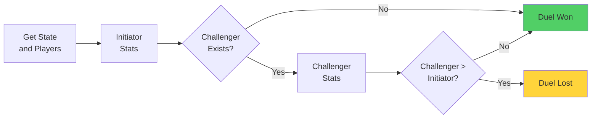

# Ball Control Duel

A Ball Control Duel is a confrontation between an attacking player (Initiator) and an optional defending player (Challenger) to determine if the initiator successfully maintains possession of the ball, based on player stats.

## Duel Steps

1. **Duel Setup** - Get the current state, initiator, and challenger.

2. **Initiator Stats** - Calculate the initiator’s stats for the ball control attempt.

3. **Challenger Stats** -
    - If the challenger exists → calculate challenger stats.
    - If the challenger does not exist → challenger stats = 0.

4. **Compare Totals** -
    - If the challenger exists:
        - If challenger total > initiator total → duel lost.
        - If challenger total ≤ initiator total → duel won.
    - If the challenger does not exist → duel won.

5. **Duel Result** - Determine the final outcome:
    - **Win (duel won)** → initiator retains possession.
    - **Lose (duel lost)** → initiator loses possession.

## Flowchart Overview

