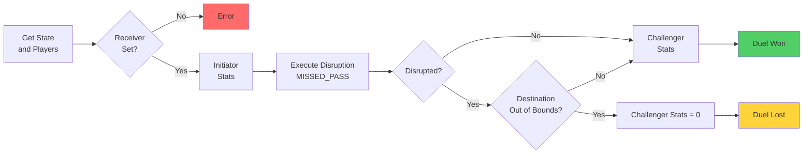

# Pass Duel

A Pass Duel is a confrontation between an attacking player (Initiator) and a 
defending player (Challenger) to determine if a pass is successfully completed 
to a receiver, based on player stats and possible disruptions like missed passes 
or out-of-bounds destinations.

## Duel Steps

1. **Duel Setup** - Get the current state, initiator, challenger, receiver, and destination pitch area.
   - If the receiver is not set → throw an error.

2. **Initiator Stats** - Calculate the initiator’s stats for the pass attempt.

3. **Disruption Check (`MISSED_PASS`)** - Execute a possible missed pass disruption.
    - If it occurs **and** the destination is out of bounds → duel ends, pass fails.
    - If not → proceed to challenger stats.

4. **Challenger Stats** - Build challenger stats.
    - If disruption with out-of-bounds did not happen, challenger stats are calculated normally.

5. **Duel Result** - Determine final outcome:
    - **Win (pass succeeded)** → if the pass was not disrupted or the destination is in bounds.
    - **Lose (pass failed)** → if the pass was disrupted **and** the destination is out of bounds.

## Flowchart Overview

