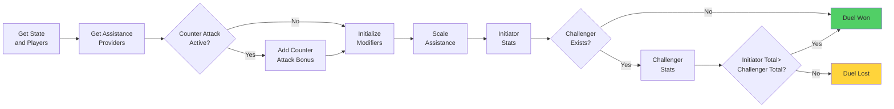

# Positional Duel

A Positional Duel is a confrontation between an attacking player (Initiator) and a defending player (Challenger) 
to determine positional advantage on the field. The duel considers assistance from other players, counter-attack
bonuses, and modifiers to calculate the outcome.

## Duel Steps

1. **Duel Setup** - Get the current state, initiator, and challenger.

2. **Assistance Provider** - Identify assistance from players on the field.

3. **Counter-Attack Check**
    - If a counter-attack exists and is active → get the counter-attack bonus.
    - Initialize modifiers and apply the counter-attack bonus.

4. **Adjust Assistance** - Adjust (scale) the assistance values for both initiator and challenger.

5. **Initiator Stats** - Build positional duel stats for the initiator.

6. **Challenger Stats**
    - If the challenger is null → duel is automatically won, and challenger stats = 0.
    - Otherwise, build positional duel stats for the challenger.

7. **Compare Totals & Duel Result**
    - If initiator stats > challenger stats → duel won.
    - If initiator stats ≤ challenger stats → duel lost.

## Flowchart Overview

