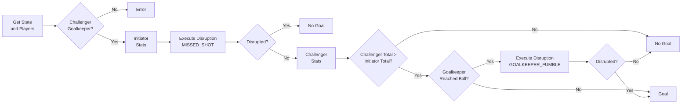

# Shot Duel

A Shot Duel is a confrontation between an attacking player (Initiator) and a defending 
goalkeeper (Challenger) to determine if a goal is scored, based on player 
stats and possible disruptions like missed shots or goalkeeper errors.

## Duel Steps

1. **Duel Setup** - Get the current state and players, and check that the challenger is a goalkeeper.

2. **Initiator Stats** - Calculate the attacking player’s stats for the duel.

3. **Disruption Check (`MISSED_SHOT`)** - Execute a possible missed shot disruption ([see details](Missed-Shot.md)).
   - If it occurs → duel ends with no goal.
   - If not → proceed to challenger stats.

4. **Challenger Stats** - Calculate the goalkeeper’s stats if the shot was not missed.

5. **Compare Totals** - Compare challenger and initiator totals.
    - If challenger total > initiator total → goalkeeper may reach the ball.
    - If not → no goal.

6. **Goalkeeper Reaction** - Check if the goalkeeper reaches the ball.
    - If no → goal is scored.
    - If yes → proceed to fumble check.

7. **Goalkeeper Fumble (`GOALKEEPER_FUMBLE`)** - Execute possible fumble disruption ([see details](Goalkeeper-Fumble.md)).
   - If fumble occurs → goal.
   - If no fumble → no goal.

8. **Duel Result** - Determine final outcome: **Win (goal)** or **Lose (no goal)**.

## Flowchart Overview

