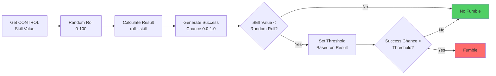

# Goalkeeper Fumble

A Goalkeeper Fumble determines whether the goalkeeper mishandles the ball during a duel, 
based on their CONTROL skill, a random roll, and chance factors. If the fumble occurs, 
it can influence the outcome of the duel (e.g., turning a blocked shot into a goal).

## Disruption Steps

1. **Get Control Skill** - Retrieve the goalkeeper’s **CONTROL skill** value.

2. **Random Roll** - Generate a random value (0-100) to compare against the skill.

3. **Calculate Result** - result = random_roll - skill_value

4. **Generate Control Chance** - Generate a random value between 0.0 and 1.0

5. **Check Fumble Threshold**
    - Compare `skill_value` and `random_roll`.
        - If `skill_value < random_roll`, calculate a threshold based on the control result.
    - Compare `control_success_chance` with the threshold:
        - If `control_success_chance < threshold` → **disruption happened** (goalkeeper fumbled).
        - Otherwise → no fumble occurred.

## Flowchart Overview

