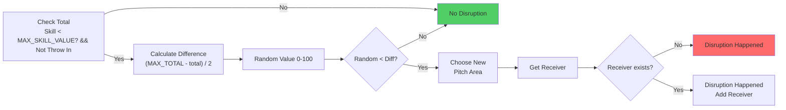

# Missed Pass

A **Missed Pass** disruption determines whether a pass attempt fails unexpectedly due to skill limitations and random chance. If the disruption occurs, the pass may go out of bounds or be redirected to a different receiver.

## Disruption Steps

1. **Check Total Skill**
    - If the initiator's total skill < `MAX_SKILL_VALUE` **and** the pass is not a `THROW_IN` → proceed to calculate disruption chance.
    - Otherwise → no disruption occurs.

2. **Calculate Difference** - difference = (MAX_TOTAL - total) / 2

3. **Generate Random Value**
   - Generate a random value between 0 and 100.

4. **Compare Random vs Difference**
   - If `random < difference` → disruption occurs.
   - Otherwise, → no disruption occurs.

5. **Choose New Pitch Area** - If disruption occurs, randomly select an adjacent pitch area near the intended destination.

6. **Get Receiver** - Attempt to get a receiver in the new pitch area.

7. **Disruption Result** - Disruption happened, if new pitch are `OUT_OF_BOUNDS` receiver not added.

## Flowchart Overview

