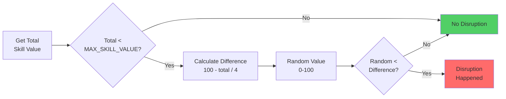

# Missed Shot

A **Missed Shot** disruption determines whether a shot attempt fails unexpectedly, based on the initiator's skill and random chance.
If the disruption occurs, the shot is missed and the duel ends with no goal.

## Disruption Steps

1. **Check Total Skill** - If `total < MAX_SKILL_VALUE` → proceed to calculate disruption chance.

2. **Calculate Difference** - difference = (100 - total) / 4

3. **Generate Random Value** - Get a random value between 0 and 100.

4. **Determine Disruption**
   - If `random < difference` → **disruption happened** (shot missed).
   - Otherwise, → **no disruption** occurred (shot continues).

## Flowchart Overview

