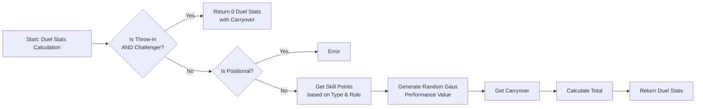

# Duel Stats

This process builds duel statistics for all non-positional duels, handling special throw-in cases and calculating final stats 
using player skills, performance, and carryover.

## Steps

1. Check if the duel type is **THROW-IN** and the player role is **CHALLENGER**.
    - If yes, return **zero duel stats** while preserving the **carryover** value.

2. Check if the duel type is **POSITIONAL**.
    - If yes, **throw an error** (positional duels are not supported by this process).

3. Retrieve the player’s **skill points** based on duel type and role.

4. Generate a **random Gaussian performance value**.

5. Retrieve the **carryover** value from previous duels.

6. Calculate the final duel stats as: **skill points + performance value total + carryover**.

7. Return the **calculated duel statistics**.

## Flowchart Overview

