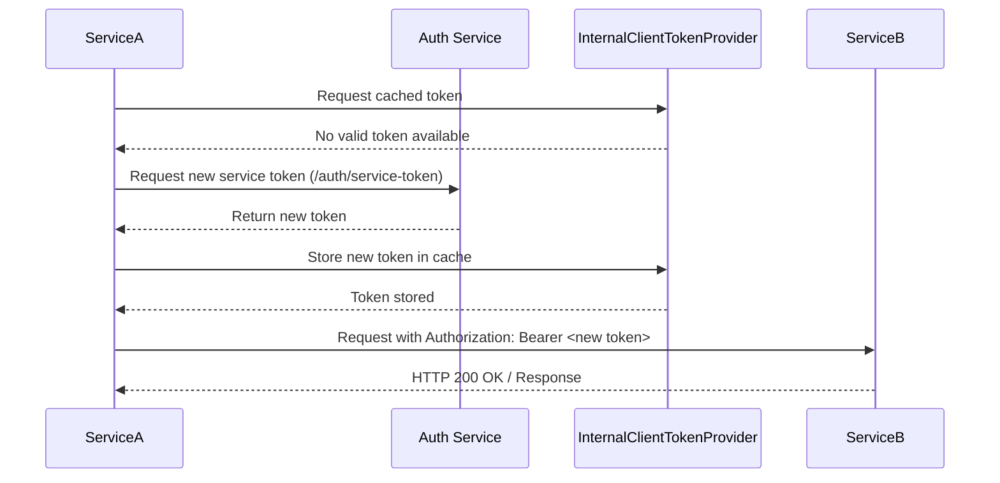
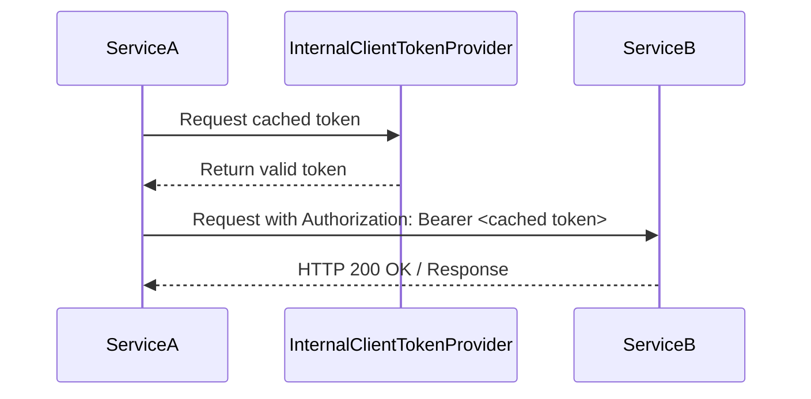

# Service to Service Communication

Service-to-service communication occurs when two internal modules interact with each other to request or share data.

The modules handle authentication using the **InternalClientTokenProvider**, which manages stored tokens.
If a valid token exists and has not expired, it is directly used in the `Authorization` header of the request.

If no valid token is available, the module first requests a token from the unprotected `/v1/auth/token-service` endpoint.
The returned token is then used for subsequent requests to the target service.

## Protected Service-to-Service Flow without valid Token

When no valid token exists in the cache, ServiceA must first request a new token from the Auth Service.
The new token is then stored in the cache and used to authenticate the request to ServiceB.

## Protected Service-to-Service Flow with valid Token

If a valid token is already available in the cache, ServiceA can use it directly in the request to ServiceB, skipping the call to the Auth Service.

