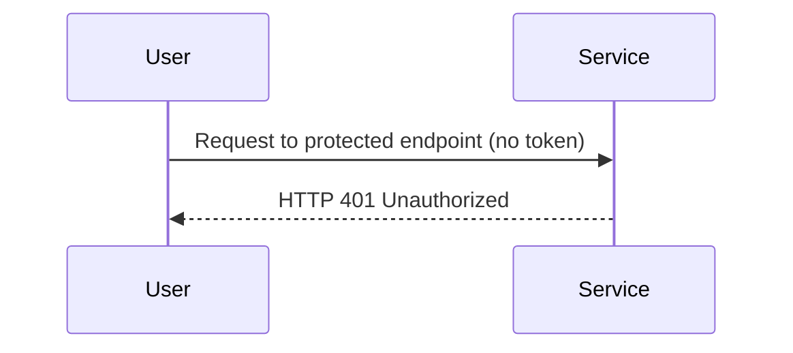
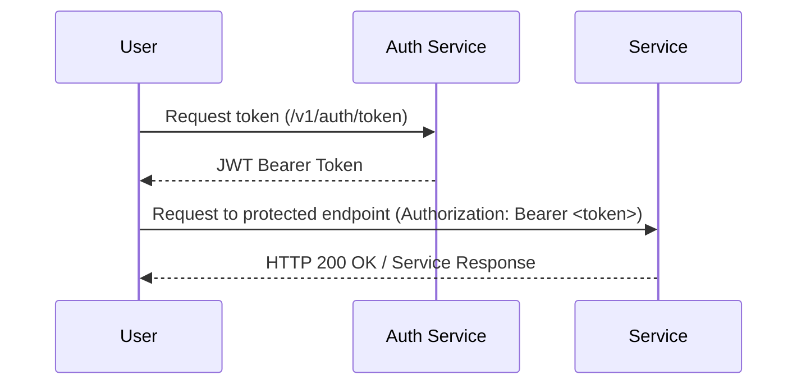

# User to Service Communication

This section describes how end users interact with the application’s services. It explains the authentication flow, how requests are validated, and what happens when users access protected endpoints.

## Protected Endpoint Unauthenticated Flow

If a user makes a request to a protected endpoint **without a token** or with an invalid token, the request is rejected:

## Protected Endpoint Authenticated Flow

This diagram shows how a user first obtains a JWT token and then uses it in the `Authorization` header to successfully access a protected endpoint.

