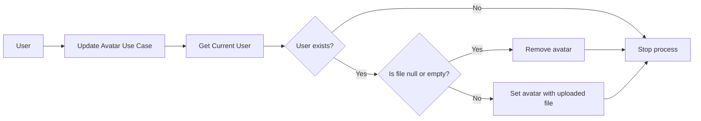

# Update Avatar Use Case

This use case describes how a user updates or removes their profile avatar in the system. The process consists of the following steps:

1. **User initiates the action** by accessing the “Update Avatar” functionality.
2. **The system retrieves the currently authenticated user.**
3. **Check if the user exists:**
    - If the user does not exist, the process ends.
    - If the user exists, the system continues.
4. **Check the uploaded file:**
    - If the file is null or empty, the user’s avatar is removed.
    - If the file contains data, the user’s avatar is updated with the new image.
5. **The process ends** once the avatar has been updated or removed.

## Flowchart

