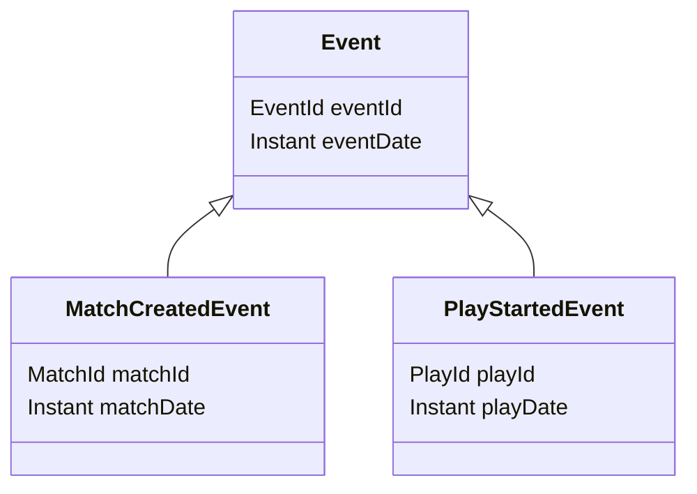

## Events

All the events of the system need to contain following information as the minimum to be able to work with Event Sourcing properly.

```mermaid
  
classDiagram
   
    Event <|-- MatchCreatedEvent
    Event <|-- PlayStartedEvent
    Event : EventId eventId
    Event : Instant eventDate
   
    class MatchCreatedEvent{
        MatchId matchId
        Instant matchDate
    }
    class PlayStartedEvent{
        PlayId playId
        Instant playDate
    }
  
```