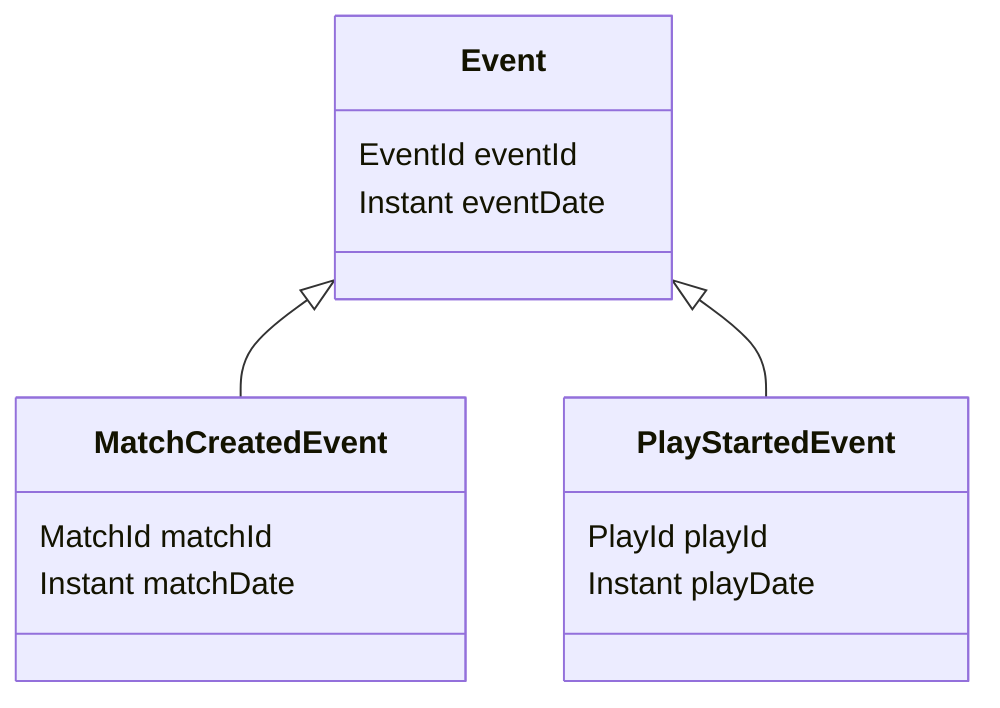

# Event Library

This is a library for centralizing data types across the multiple services.

## Events

All the events of the system need to contain following information as the minimum to be able to work with Event Sourcing properly.

| Event Name | Topic | Description |
|----------|-------------|-------------|
| *SignupEvent* | SignupEventTopic | Generated when the user account get's created |

