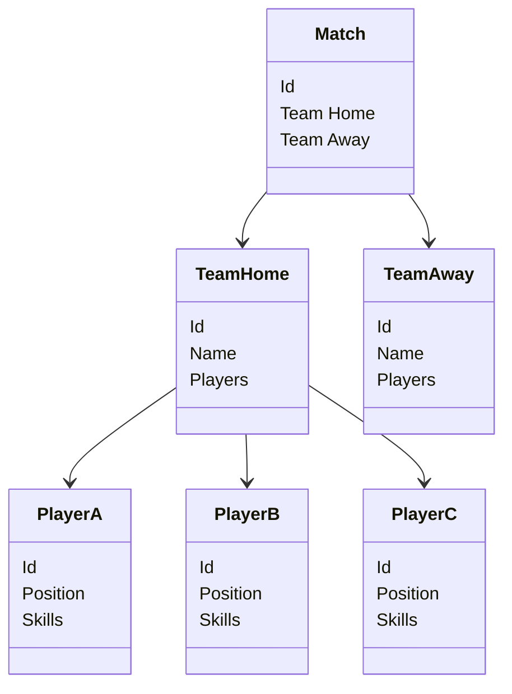
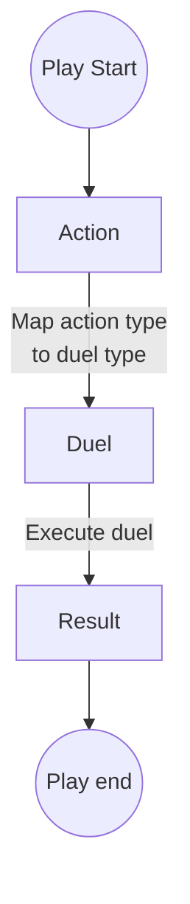
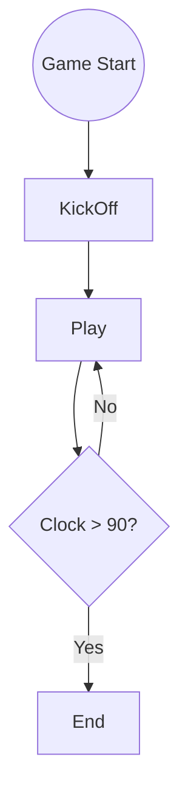
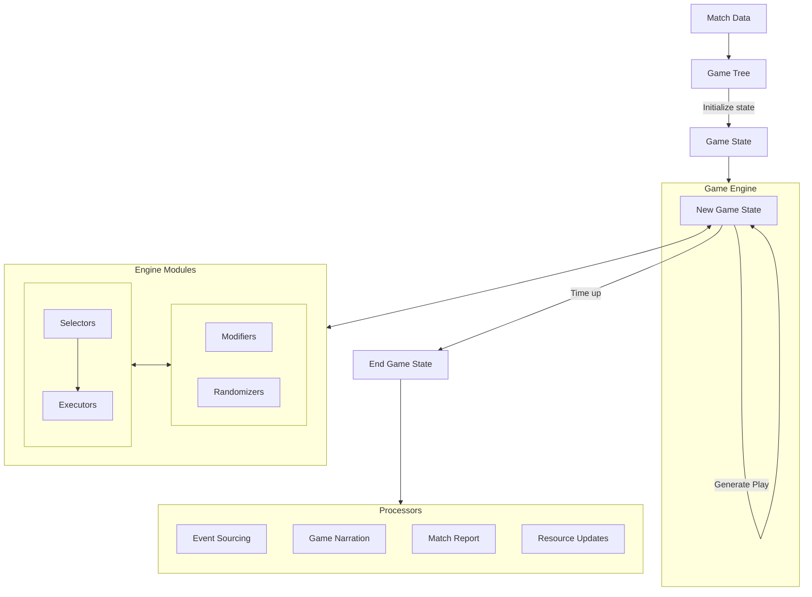

# Match Service

The match service is responsible for simulating games between teams.

## Game preparation

Before a game can be played, the game engine needs a data structure that contains all the
information required to execute the game: teams, attributes, players, skills, etc.

This information is aggregated from the database and stored in a tree structure that is then passed
to the game engine.



## Game state

From the data in the tree, the engine constructs a state that represents, at any given time, a
snapshot of the game. The kind of information that could be represented here includes:

- Clock: how many minutes have passed since the start of the game
- Added time: how many minutes have been added to the clock due to fouls and injuries
- Play positions: where each player is on the field
- Ball position: which pitch area the ball is in
- Ball holder: which player has control of the ball
- Score: how many goals each team has scored
- Fouls: how many fouls each team has committed
- Cards: which players have been booked
- Injuries: which players have been injured
- Substitutions: which players have been substituted

When something in the gameplay happens, the game state is updated to reflect the changes. For
example, suppose that a player passes the ball to a teammate. In this case, we need to update the
clock, based on how long it takes to complete a pass, and the ball state, based on the receiving
player and their location. Everything else stays the same in this scenario.

| **State attribute** | **Before**  | **After**   |
|---------------------|-------------|-------------|
| Clock               | 20          | 22          |
| Added time          | 1           | 1           |
| Player positions    | [positions] | [positions] |
| Ball position       | Left back   | Midfield    |
| Ball holder         | Player F    | Player G    |
| Score               | 2           | 2           |
| ...                 | ....        | ...         |

## Game play

### Plays, Actions, Duels, and Opportunities

The terms used here correspond to the classes in the game engine.

The basic unit of gameplay is a `Play`. A play is a single action that transitions the game from one
state to another. Each play has a type of `Action`: a pass, a dribble, a shot, etc.

Each play also involves a `Duel`, which is an interaction between two players. For example, a shot
is a duel between the shooting player and the goalkeeper. The player initiating the duel can win or
lose the duel - this is the `DuelResult`.

There are some instances were plays require a non-standard duel setup. For example, plays that
involve a duel which should always result in a win (or a loss). Here we can create a dummy duel that
can never be lost. Another special case is the play that involves multiple duels. Under the hood, at
least, each play must lead to a single duel, so here the play is simply split into two plays, each 
with its own duel. This ensures a one-to-one mapping between actions and duels.

The information required to create a duel depends on the action. Sometimes a teammate is necessary
in addition to the player on the opposing team.

- The player who started the duel (the attacking player) is called the 'initiator' to avoid
  confusion with the player position 'attacker'.
- The player who defends the duel is similarly called the 'challenger' to avoid confusion with the
  'defender' position.
- The player who receives the ball (in the case of a successful duel) is the 'receiver'. This
  applies only to actions such as passes, not shots.

Where the ball eventually ends up is determined by who wins the duel and if there was a receiver
present. If the initiator wins the duel, then the ball goes to the receiver if one is present (e.g.
in a pass) but if there is no receiver then the initiator retains the ball (e.g. in a dribble). If
the duel is lost then the ball goes to the challenger (e.g. a tackle).

At the end of a game, the list of plays will contain all the plays that happened in the game, their
action type, the duels engaged, and the outcome of each duel. Any other metadata might be stored
here as this list of plays is effectively the entire history of the game. A sample snippet of the
plays might look like this:

```json
{
  "plays": [
    {
      "action": "PASS",
      "duel": {
        "duelType": "PASSING",
        "initiator": "<player A>",
        "challenger": "<player B>",
        "receiver": "<player C>",
        "result": "WIN"
      },
      "minute": 2,
      "pitchArea": "MIDFIELD"
    },
    {
      "action": "DRIBBLE",
      "duel": {
        "duelType": "BALL_CONTROL",
        "initiator": "<player C>",
        "challenger": "<player D>",
        "result": "WIN"
      },
      "minute": 3,
      "pitchArea": "MIDFIELD"
    }
  ]
}
```

Plays can be aggregated into an `Opportunity`, which is a sequence of plays from the same team and
ends in either a goal or the attacking team losing control the ball. Some plays that do not
constitute opportunities might be ignored when aggregating into opportunities. For example, a pass
that is intercepted by the opposing team is not considered an opportunity.

A mapping between actions and duel types exists to determine which duel to execute for each play.
Note that actions are verbs written in imperative or infinitive form ("shoot" instead of "shooting"
or "shot") to distinguish them from duel types, which are written either as nouns ("shot" duel) or
adjectives ("positional" duel) or present participle ("passing" duel), or whatever is necessary
to avoid naming conflicts.

| **Action** | **Duel Type**     |
|------------|-------------------|
| Pass       | Passing duel      |
| Position   | Positional duel   |
| Dribble    | Ball control duel |
| Shoot      | Shot duel         |
| Foul       | Aggressiveness    |
| Penalty    | Shot duel         |

### Play generation

To generate a play, the engine selects an action for the player in possession of the ball. From this
it determines the duel type and the other participants (challenger and/or receiver). Then the duel
can be executed, and the result is determined. The play is now complete and the game state can be
transitioned depending on the details of the duel.



The game engine continues generating plays until the game ends. This is when the clock passes
90 minutes (ignoring added time, extra time, penalties, etc. for now).

The only exception to this is the first play, the kick-off, which is a special case of play that
happens at the start of the game. A player has to be selected here since no player is in possession
of the ball at the start of the game. This is a point where modifications to the game could be
made - strategies could be applied, for example.



## Engine components

There are four components that are used to generate plays.

### Selectors

In the play generation described above, there are some decisions to be made: which players to
select at kick-off, which actions to take, and in the resulting duels, which participants to
select (the challengers and the receivers).

Whenever a decision is needed, this is delegated to one of the selection classes. These are
stateless and take as inputs the game state and return a selection for the play generation to
continue.

When selecting players, the relevant information might be which pitch area the ball is in, the type
of action being performed, and the team and player details.

When selecting actions, first, the previous play is required to know what actions are valid for the
current play. For example, if a player shoots and misses, the next play cannot be a dribble, since
the only legal move after this is a goal kick. If a player kicks the ball out of play, the next
action must be either a corner or a throw in.

Note that the list of valid actions applies to the team executing the play. If a duel is won, then
the actions apply to the same (attacking) team that initiated the duel. If the previous duel is
lost, then the actions apply to the opposing (defending) team from the one that initiated the duel.

Further, the actions are in relation to the player who took control of the ball at the end of the
duel. If the duel was a pass and resulted in a win, for instance, then the actions relates to the
teammate who received the ball. If the duel was a shot and resulted in a loss, then the action
applies to the goalkeeper who saved the ball.

| **Previous Action** | **Valid actions if duel won** | **Valid actions if duel lost** |
|---------------------|-------------------------------|--------------------------------|
| Pass                | Position                      | Throw-in, goal-kick            |
| Position            | Pass, shoot                   | Dribble, foul, offside         |
| Dribble             | Pass, shoot, foul             | Foul, corner, throw in         |
| Shoot               | Goal                          | Corner-kick, goal-kick         |

Once a list of valid actions is determined, the selection class will choose one based on other
players in the area, player attributes, etc.

### Executors

Once the selection classes have chosen players and actions, a duel is executed. To determine the
result of a duel, the executor classes are used. Like selectors, these are also stateless and take
as inputs the game state and the duel details, and return a result.

A simple duel result might be calculated from the player attributes. For example, if the initiator's
passing abilities are better than the challenger's defending abilities, then the initiator wins the
duel. More complex strategies can be developed to determine duel results.

### Modifiers

For the selection of players, actions, duels, duel participants, and duel results, modifiers are
added to the process as a form of strategy.

### Randomizers

In addition to modifiers, the game engine also includes randomness to add an element of
unpredictability to selection and execution processes. This is done using the randomizer classes.

## Implementation

This service is built in functional Java. Ignoring some rare exceptions (and randomness/logging),
this service uses and should continue to use pure functions, the Stream API for list processing, and
the Optional API for dealing with mappings and transformations. It also makes use of
immutable objects wherever possible, in particular for the game state (see below). Other things to
avoid are excessive inheritance (polymorphism should be achieved through interfaces, but composition
is preferable in general) and overuse of nulls.

### The game state object

The game state object is immutable, meaning that it cannot be modified once it has been created.
Instead, the engine will create a new state every time a play is executed (the old one is
discarded),
without [side effects](https://en.wikipedia.org/wiki/Side_effect_(computer_science)). This pattern
reduces bugs, ensures that the game state is consistent, and makes it easy to reason about the
transitions: a function takes the previous state as an input and return a new state based the play,
so there is no need to worry about what other functions are doing. It also allows testing of
functions in isolation since each function is responsible for only the code within its scope.

### Post-game processing

After the game is completed, the list of plays can be used to generate a match report and to save
opportunities to the database, and for anything else that might be required. For example

- Event sourcing - for integration with the event sourcing model, the list of plays can be used to
  create use cases and events.
- Game narration - by turning each play into a readable sentence a narrative game can be created
- Resource updates - players and teams can also be updated based on their game performance
- Match report - a summary of the game, including statistics (possession, shots on target, etc.)

All of this is done after the game finishes to verify that each play was valid and led to a legal
end state. If the game generation fails, the list of plays can be discarded and a new game can be
recreated from the same game tree, and nothing is lost.

### Overall architecture

In summary, the match service takes data from a match, construct a game tree, and passes it to the
game engine. The engine generates plays, applies them to create new states, and does so with the
help of stateless modules:

- Selectors (for choosing players, actions, and duels)
- Executors (for executing duels and determining their results)
- Modifiers (for adjusting the results of selectors and executors)
- Randomizer (for adding unpredictability to the selection and execution processes)

At the end of the game, the end state and list of plays are used in post-processing modules to
generate any information required by the rest of the application.



### Performance

The game engine should be fast and efficient, despite the use of immutable objects. Benchmarking
should be performed to ensure that the engine is consistently producing results in a reasonable
time.

With random team data, the engine can currently simulate 100,000 games in about one second. As the
complexity of the teams, strategies, selectors etc. increases, this will be monitored to ensure that
the engine remains fast. Certain expensive operations like duplicating lists can be optimised to
keep performance adequate but unless a bottleneck is observed and optimisations are required, the
engine will be kept simple for the sake of readability and maintainability.
